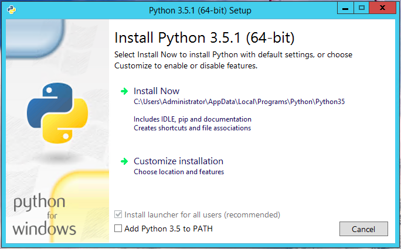
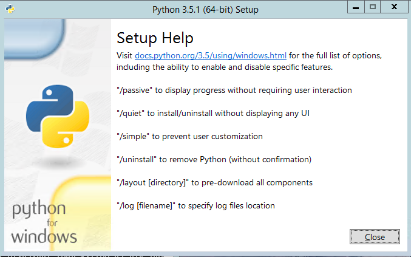

# Windows

## 下载安装包
进入Python官网的 [windows downloads](https://www.python.org/downloads/windows/) 页面，以Python 3.5.1为例，可以看到除了帮助文件之外一共有6个安装包可以下载，操作系统位数分为32位(X86)和64位(x86-64)，安装包类型分为embeddable、executable、web-based三种，所以一共有 2*3 = 6 个安装包可下载。

需要注意的是从Python 3.5开始就只支持Windows Vista及以上的版本，如果是Windows XP则只能选择安装Python 3.4。如何查看操作系统版本和位数可以参考 [微软官方帮助文档](https://support.microsoft.com/zh-cn/help/13443/windows-which-version-am-i-running)。

3种不同类型的安装包区别如下：
* embeddable：嵌入式包，相当于绿色版Python，短小精干且无需安装，可直接嵌入到其他应用中使用
* executable：离线安装包，包含默认安装所需的所有组件，可用于离线安装
* web-based：在线安装包，只是一个安装器，在安装过程种需要联网下载安装所需的组件

## 图形界面安装
下面以Python 3.5为例进行说明，双击安装包进入图界面安装：  


如果选择 `Install Now`，会安装到当前用户目录下，也就是说安装后只有当前用户可以使用。  
如果选择 `Customize installation` ，可以选择为所有用户安装，也可以自定义安装路径。

如果同时安装了多个版本，推荐都勾选上 `Install launcher for all users`，安装好之后可以使用py命令指定运行版本，比如同时安装了3.5和3.7，则可以使用 `py -3.5` 或 `py -3.7`指定运行版本。更多关于 `Python Launcher` 的内容可以参考官方文档 [Python Launcher for Windows](https://docs.python.org/3.5/using/windows.html#python-launcher-for-windows)

如果不是多版本并存的系统上，建议都勾选上 `Add Python 3.5 to PATH`，这样会把Python的安装路径自动添加到环境变量 `PATH` 中，避免在命令行中执行 `python` 命令时系统不能识别。如果是多版本并存的系统上可以不用勾选，然后都使用 `Python Launcher` 进行多版本管理。

## 命令行安装
可能很多同学不知道，Windows下的Python安装包其实也支持命令行的方式安装，这个在用于制作自动安装程序或者批量安装时非常有用。

我们以下载的64位的3.5.1的安装包为例，下载后的安装包名称为 `python-3.5.1-amd64.exe`，在命令行(cmd)中切换到安装包所在路径，然后执行 `python-3.5.1-amd64.exe /?`，可以看到如下图所示的命令行安装帮助：  
  

可以使用 `name=value` 的方式指定安装参数，比如为所有用户安装 `InstallAllUsers=1`，还有自动添加安装路径到PATH环境变量 `PrependPath=1`，完整的安装参数请参考官方文档 [Installing Without UI](https://docs.python.org/3.5/using/windows.html#installing-without-ui)。

比如以下安装命令就表示不需要用户干预但是会显示安装过程的自动安装，并且为所有用户安装，并且自动添加安装路径到PATH环境变量：
```sh
python-3.5.1-amd64.exe /passive InstallAllUsers=1 PrependPath=1
```

# Linux
大多数的Linux发行版都自带了Python2，系统自带的python2一定不要删除，因为通常会有一些系统自带软件依赖于它，如果要安装Python3可以通过下面几种方式。

## 通过安装源在线安装
如果你的电脑可以连接互联网，或者在一个内部网络上但是有内部安装源，推荐使用这种方式。不同的Linux发行版有不同的安装源工具，以CentOS7为例，CentOS7自带的python版本是2.7，CentOS上的安装源工具是yum，我们可以通过命令 `yum install python3` 来安装Python3，目前CentOS7官方yum源的python3的版本应该是3.7，安装完成后可通过键入 `python3` 查看是否安装成功

需要注意的是在CentOS上安装好Python3后一定不能修改系统默认链接 `/usr/bin/python` 指向python3，否则运行yum时会得到如下错误：
```sh
  File "/usr/bin/yum", line 30
    except KeyboardInterrupt, e:
                            ^
SyntaxError: invalid syntax
```
这是由于yum依赖于系统自带的python2，改成python3之后由于语法不兼容，所以会出现错误。所以应该保持链接 `/usr/bin/python` 始终执行系统自带的python2。如果在其他Linux发行版上也遇到类似问题可以参考这种情况。

## 使用包管理器离线安装
不同的Linux发行版也有不同的包管理方式，安装源在线安装本质上就是自动从源上下载安装包然后使用包管理器进行安装。好处是方便，但是如果电脑不能联网就只能提前下载好安装包，然后使用系统自带的包管理器进行离线安装。

还是以CentOS7为例，CentOS的包管理器是 `rpm`，比如已经下载好的rpm安装包名为 `python35-3.5.1-xxx.rpm`，那么可以使用命令 `rpm -ivh python35-3.5.1-xxx.rpm` 进行离线安装。

离线安装包的下载可以通过各Linux发行版官网进行下载，也可以通过国内的镜像源网站下载，速度会比国外的快一些，这里列出几个常用的国内源：
* 清华大学：https://mirrors.tuna.tsinghua.edu.cn/
* 网易：http://mirrors.163.com/
* 阿里巴巴：https://developer.aliyun.com/mirror/

## 使用源码编译安装
Python官网提供 [源码下载](https://www.python.org/downloads/source/)，下载解压后可通过make三连击 `./configure && make && make install` 进行编译安装，前提是系统上已经配置好gcc等编译安装环境，如果对Linux不是很熟悉的用户不推荐使用此方式，因为出现安装问题的解决难度较大。

# macOS
macOS是在BSD(Berkeley Software Distribution)的基础上发展而来，而BSD是一个派生自Unix的操作系统，而Linux又是一个类Unix系统，所以macOS安装Python的方式也和Linux大体上差不多，主要分下面两种方式。

需要注意的是macOS同样也自带了python2，系统自带的一些软件也会依赖于此，所以也一定不能删除。以macOS 10.15为例，自带的python2.7安装在 `/System/Library/Frameworks/Python.framework/Versions/2.7` 路径下。

## 使用Homebrew在线安装
Homebrew是macOS上的一种安装源工具，类似于CentOS的yum，直接使用如下命令安装即可：
```sh
brew install python3
```

## 图形界面安装
可去Python官网下载 [macOS installer](https://www.python.org/downloads/mac-osx/)，下载后双击进行图形界面安装，安装选项说明大体和Windows类似，这里不再赘述。

# Python命令行使用
除了在命令行直接键入 `python` 进入Python交互式命令行的使用方式外，在命令行下使用Python通常还有下面三种方式

## python -c command
通过这种方式可以快速的执行python命令：

```sh
python -c "print('hello, world!')"
```

## python stript
通过这种方式可以直接执行一个脚本文件：

```sh
python mystript.py
```

## python -m module_name
通过这种方式调用一个安装好的python模块，比如可以使用python自带的http.server模块临时启动一个http服务器：

```sh
python -m http.server
```

# 引用
1. [Python安装]：https://www.liaoxuefeng.com/wiki/1016959663602400/1016959856222624
2. [Python Setup and Usage]：https://docs.python.org/3.5/using/index.html